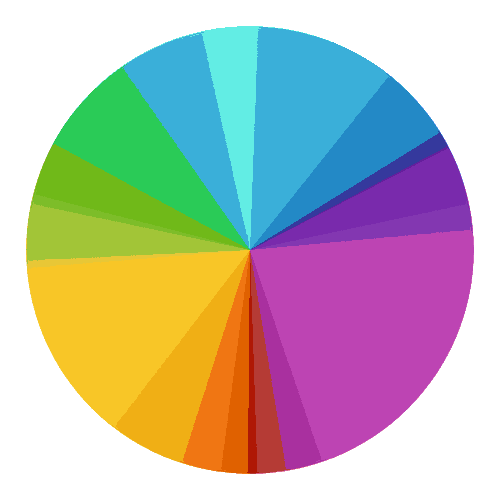
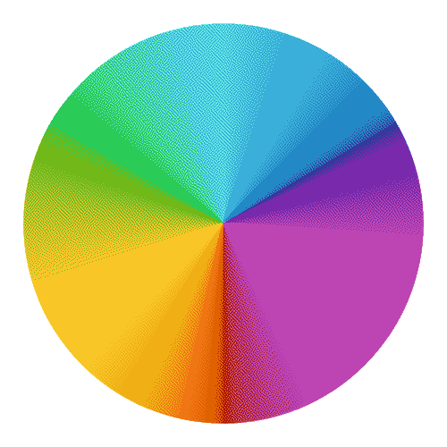

## 关于支持的平台 / 游戏版本

### 是否支持 iOS/MacOS ？

暂不。我手上没有iOS/MacOS的设备没办法调试。

### 做个网页版？

快了，~~真的快了吗~~。我 ~~正在~~ 早就计划此事，但是因为[懒惰](https://baike.baidu.com/item/%E4%B8%83%E5%AE%97%E7%BD%AA/29700)发作此工作还在 ~~进行~~ 搁置中。

<figure className="flex flex-col items-center [&_img]:mx-auto [&_img]:w-40 [&_img]:max-w-full [&_img]:h-auto [&_p]:my-0">
  
  <figcaption className="text-center text-sm text-fd-muted-foreground">
    《以撒的结合：重生》中的敌怪 [“超级懒惰”](https://isaac.huijiwiki.com/wiki/%E5%AE%9E%E4%BD%93/46)
  </figcaption>
</figure>

### 是否支持 Java 版 Minecraft？

永不。对于 Java 版 Minecraft，我推荐您使用 SlopeCraft。

  <Card
    title="SlopeCraft"
    description="Map pixel art generator for Minecraft."
    href="https://github.com/SlopeCraft/SlopeCraft"
  ></Card>

### 是否支持中国版（网易版）MC？

暂不。因为我不玩中国版。但据我所知现如今应该有相当多的工具可以将 mcfunction / mcstructure 转为某种可以用于导入中国版的格式，
或是直接导入中国版，但具体细节我不清楚。

如果您是开发者且有兴趣支持网易的导出，欢迎为 Colorify 贡献代码。

当然，如果您不是开发者但是有对应技术资料和消息，也欢迎您提供给我，我可能会在资料足够完整时加入对中国版的支持。

## 关于基本使用方法

### 如何使用 Colorify

请在目录打开您想要的教程仔细查看。

### 点击生成以后没有反应

这是一个 v6 版本的 Colorify 被多次反映的问题，但在查清之前，我已经写好了 v7 版本，因为经过彻底的重构，理论上这个问题已经被避免。
即虽然我也不知道为什么，但是使用 v7 版本极大概率可以解决您的这个问题。

### 生成的文件在哪里？/ 找不到输出文件

对于 Android 安卓用户，见 emulated/0/Download/colorify 下。

对于 Windows 用户，每次生成都会在「文档（Documents）」下的 colorify 目录里创建一个以时间命名的文件夹（如 `Documents/colorify/2026-08-23_12-00-00`），mcfunction / mcstructure 文件与预览图 preview.png 都在其中。生成完成时界面也会显示输出路径。

### 如何把 mcstructure 文件导入游戏？

总的来说，通常您需要构造一个行为包，这个行为包里包含一个 `structures` 文件夹，把生成的结构文件放在里面。
将这个行为包导入游戏后，您就可以在游戏内使用结构方块（Structure Block）加载这些结构，或者使用 `/structure load <名称>` 命令。mcfunction 文件可通过命令方块或聊天栏直接执行。

### 结构（.mcstructure）文件无法加载

这可能是因为您的结构太大，导致部分区域已经进入了未加载区块，您可以手动设置 `/tickingarea` 来确保对应区域加载后，再尝试生成结构。

  <Card
    title="/tickingarea"
    description="添加、删除或列出常加载区域。"
    href="https://minecraft.wiki/w/Commands/tickingarea"
  ></Card>

## 关于 WebSocket

### 无法连接至 WebSocket 服务器 / WebSocket 连不上游戏

Windows 用户请先在 WebSocket 页面查看教程链接解锁 UWP 应用回环，然后在游戏设置中开启「已启用 WebSocket」、关闭「需要加密的 WebSocket」。使用 `/connect 127.0.0.1:<端口>` 连接。

### WebSocket 连接关闭

请确保 Colorify 7 仍在运行。请您检查：

1. Colorify 是否被关闭
2. Colorify 被挂至后台（如果您是 Android 安卓用户，建议使用小窗/分屏模式）

### WebSocket 服务器启动失败

请检查端口是否被占用，或尝试前往设置更换 WebSocket 端口。

## 关于效果

### 阶梯式像素画生成不全

阶梯式像素画通常需要占用大量的高度，请您检查您的阶梯式像素画缺失的部分是否生成在了地底或是超出了世界最大高度

在版本 v7.0.2 以后，阶梯式默认开启“无损压缩”功能，在开启这个功能后，所有阶梯式方块都将生成在召唤坐标的 y 水平之上，可以有效地解决这个问题。

### 像素画生成大片缺失

如果您的像素画是小面积（如某些条状、洞状缺失）而非大面积缺失，请看下一条。

这通常是加载问题引起的。

- 如果您使用的是 WebSocket 传输，那么建议您不断地飞行至生成边缘来确保最新的位置已被加载
- 如果您使用的是 mcfunction 文件，那么建议您使用 execute positioned x y z run function output_xxx 并不断飞行来确保对应位置已经被加载
- 如果您使用的是 mcstructure 文件，那么建议您使用 /tickingarea 设置常加载区块来确保对应结构加载区域已被加载

  <Card
    title="/execute"
    description="/execute是各不同功能的子命令的集合，用于改变命令执行上下文（修饰子命令），执行逻辑判断（条件子命令）和管理并存储命令返回值（存储子命令）[仅Java版]，并在此基础上执行任意其他命令。"
    href="https://minecraft.wiki/w/Commands/execute"
  ></Card>
  <Card
    title="/tickingarea"
    description="添加、删除或列出常加载区域。"
    href="https://minecraft.wiki/w/Commands/tickingarea"
  ></Card>

### 像素画生成部分缺失（洞状 / 条状）

如果您的像素画是大面积（如只有一半、消失了 10% 及以上）而非小面积缺失，请看上一条。

这可能是因为 ID 不匹配导致，也许您的 Minecraft 版本过老，或是 Minecraft 的更新导致了 Colorify 的调色板过时，
这边建议您生成 mcfunction 并导入世界然后观察报错来找出对应的方块 ID 然后禁用，或是尝试给 Colorify 的调色板提交 Issue/PR；
如果您的版本在 1.19.x 左右，您可以尝试下载 Colorify 6 来使用扁平化处理来尝试解决此问题；
Colorify 7 将不会支持扁平化，只对齐基岩版最新版本。

### 生成很慢或卡住（尤其是 3D 模型）

大模型的体素化需要较长时间（射线与体素计算量很大）。若模型体积过大，程序会自动降级为空心外壳以节省时间。请耐心等待进度条；若长时间无响应，可尝试缩小模型或减少三角面数量。

### 生成结果颜色和原图不一致

这是调色板限制导致的正常现象：游戏可用方块颜色有限，程序会匹配最接近的方块。

对于像素画，您可以尝试更换[色差公式](./pixel_params/color_distance.mdx)，效果最好的是 CIEDE2000。
如果您的像素画足够大，也可以尝试开启[颜色抖动](./pixel_params/dithering.mdx)，你大概可以认为颜色抖动是一种
用空间换效果的处理技术，对于面积越大的像素画，抖动的效果就会越好；相反，如果您的像素画本身很小，那么
开启抖动的效果大多就会比较一般，会出现很明显的“麻子”效果。

<figure className="grid grid-cols-2 gap-4 [&_figure]:m-0 [&_div]:flex [&_div]:flex-col [&_div]:items-center [&_img]:my-auto [&_img]:h-50 [&_img]:w-auto [&_img]:object-contain [&_p]:my-0">
  

    
    <figcaption className="text-center text-sm text-fd-muted-foreground">
      色轮 500x RGB 无抖动
    </figcaption>
  

  

    
    <figcaption className="text-center text-sm text-fd-muted-foreground">
      色轮 500x CIEDE2000 无抖动
    </figcaption>
  

  

    
    <figcaption className="text-center text-sm text-fd-muted-foreground">
      色轮 500x RGB Atkinson 抖动
    </figcaption>
  

  

    
    <figcaption className="text-center text-sm text-fd-muted-foreground">
      色轮 500x CIEDE2000 Atkinson 抖动
    </figcaption>
  

</figure>

由上图也可以看出，像是紫色和黄色以及浅蓝色等区域的面积都较大，色域面积大这意味着在这一色域 MC 原版方块的颜色是比较少的，
效果也会比较差，所以在生成时要尽量避免选择这些稀缺颜色较多的图片。例如如果您找一个大面积用紫色系及其灰度来描绘整幅画面的图片，
那么生成的效果我估计会超乎想象地差，这并不是 Colorify 的问题，而是 Minecraft 原版方块的调色板本身就不够丰富。

### 体素生成有很多奇怪的黑色块

对于体素生成，部分模型的法线/贴图问题会采样到黑色占位贴图，可尝试更换模型。

### 处理超大图片时程序崩溃或闪退

您可能会在使用超大图片生成时遇到崩溃或闪退的问题，这种情况通常只会在您开启了“使用结构”选项时出现，
因为尽管 Colorify 已经针对 .mcstructure 文件的输出做了流式输出与内存优化（经我在自己的设备上测试，生成 50G 大小以内的结构文件是毫无压力的。
对于大部分使用场景，生成时间在 10s 以内），但因为 .mcstructure 文件的格式特性，
图片尺寸极大（如数千万像素）时的构建过程仍可能超出设备能力。
如果实在无法解决，请先缩小图片尺寸或更换性能更好的设备。

如果您没有开启“使用结构”选项，那么您的图片可能已经来到了一个非常恐怖夸张的尺寸，又或者是您的设备可能实在是年老力衰风烛残年了。
但如果您确信您的设备性能足够且图片尺寸不算大，但仍然出现了崩溃或闪退，您也可以联系我 QQ：3695178121 提供给我您的具体使用/设备参数和原图，
以便我分析是否真的是 Colorify 出了问题。

### 包导入游戏失败

如果您使用的 Colorify 版本小于 6.1.1 时（即 6.1.0 及以前），您可以尝试把包的后缀从 .mcaddon 改为 .mcpack，大概率即可解决问题。
如果您使用的 Colorify 在 6.1.1 及以上，不应该出现这种情况，如果您遇到了，请联系我QQ：3695178121。

## 求助

### 应用行为异常？

您是否正在使用鸿蒙系统？

- 是：Colorify 不支持该系统
- 否：请见最后一条常见问题

### 问题还没解决，如何联系作者？

请前往「关于」页面获取作者联系方式（邮箱 / QQ），或到 GitHub 仓库提交 Issue。反馈时请附上生成参数、所用图片/模型与日志，方便快速定位问题。
