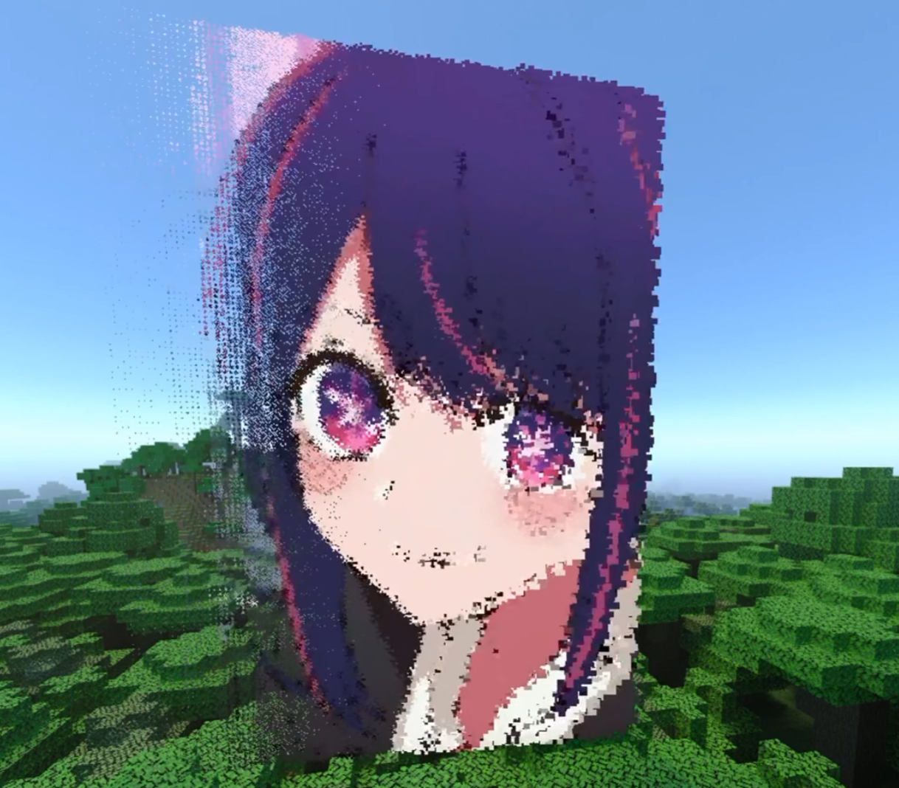
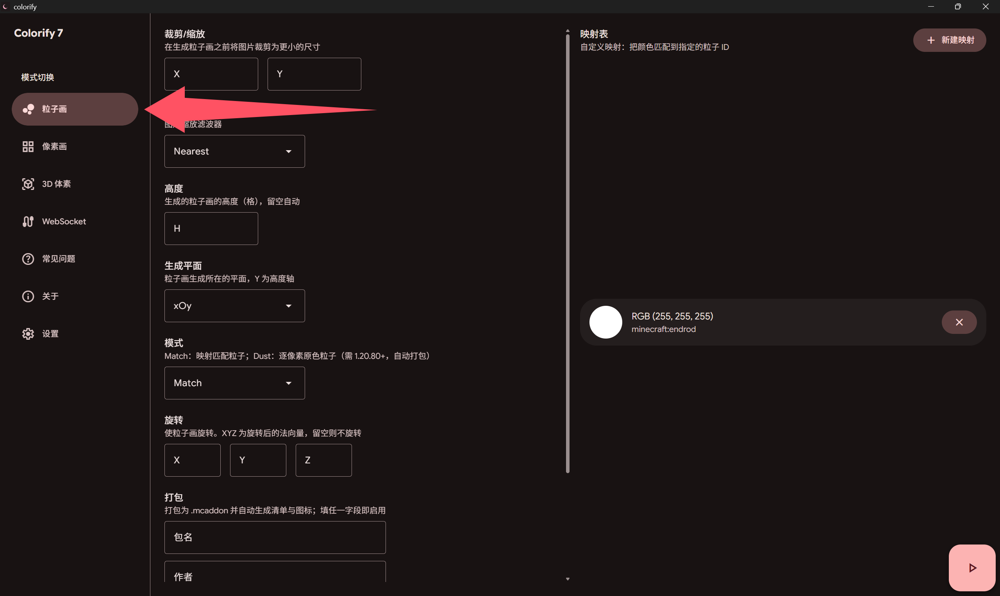
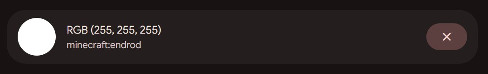
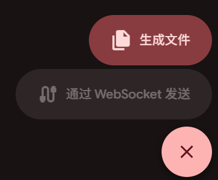

粒子画，即用一堆粒子通过规律地排布去近似地呈现图片的图案。通常是一个粒子模拟一个像素。

<Callout type="tip" title="什么是粒子？">
  如果您不知道什么是粒子，可以参考 [Minecraft Wiki -
  Particles](https://minecraft.wiki/w/Particles) 的介绍
</Callout>

将此页面从头到尾看一遍，相信您就会使用粒子画生成功能并在游戏中成功地生成粒子画。

## 粒子画能做到怎样的效果？

在 Minecraft 原版中内置了不少粒子（下称游戏内置粒子为 **原版粒子** ），但大多由于其形状、颜色、动画等原因不适宜用来绘制粒子画，Colorify 唯一的默认粒子即 `minecraft:endrod`（如果您使用的 Colorify 版本低于6.1.1，默认的粒子是`colorify:endrod`，从命名空间名称即可看出此粒子并非原版粒子，在打包生成时 Colorify 会自动生成这个粒子，这个粒子大概是`minecraft:endrod`的简化版），此粒子体积较小，动画简单，呈白色。

### 单色 / 轮廓粒子画

由于上面提到了默认的粒子`minecraft:endrod`呈白色且没办法动态地更改其颜色所以 **如果您不使用资源包添加自定义粒子，就没办法得到很好的粒子画效果**，在这样的条件下，粒子画通常为 _描边画_，即只描绘图片中的线条，比如魔法阵、二次元人物 **轮廓** 等等这样的图案可以得到比较好的效果，没办法描绘大面积的颜色（其实也行，只是所有颜色都只能是一种颜色：白色）。

当然，创建自定义粒子并不是什么麻烦事，在映射表中定义了映射并启用打包功能时 Colorify 都会 **自动地创建对应的纯色粒子供您使用**。

<Callout type="warning" title="警告">
  如果您在映射表中定义了非原版粒子并且 **没有启用打包功能** 时，即 Colorify
  只会生成函数文件，如果您自己没有准备好对应的粒子，您在游戏里什么也看不见。
</Callout>

### 全彩模式

那么粒子画就只能做到这样吗？当然不是，粒子画甚至比像素画能做到的还要多，如果您的游戏版本在1.20.80及以上，不妨试试 **Dust 模式**。这个模式可以完美地、准确无误地重现您的图片的每一个像素的颜色。技术详情请见[这里](../arguments_table/particles/mode.md)。当您使用了Dust模式时，您只能[通过实体召唤粒子画](#方法二通过实体召唤粒子画)。

不过需要提到的是，全彩模式通常比较消耗性能，在分辨率不较低的情况下，一般也无法在游戏中看到完整的粒子画，所以这个模式通常只适合用来生成一些简单的图案，或者是一些小型的粒子画。当然由于这个模式的色彩还原度极高，作为昙花一现的视觉效果也是不错的。

<figure className="flex flex-col items-center [&_img]:w-2/3 [&_img]:mx-auto [&_p]:my-0">
  
  <figcaption className="text-center text-sm text-fd-muted-foreground">
    Dust 模式下的全彩粒子画效果 | 人物：星野爱
  </figcaption>
</figure>

## 来到粒子画生成页面

点击粒子画页面按钮<span className="text-gray-400">（三个泡泡模样图标）</span>时，您便会处在粒子画参数页面。



## 设置参数

在上图中可以很直观地看到，粒子画页面被分为两大区域，左侧是**参数设置区域**，右侧是**粒子画调色板**，也称映射表

如果您对怎样设置各种参数没有头绪，请在左侧文档目录查看 **参数表**

<Callout type="tip" title="提示">
  如果您实在是拿不准怎么填写各个参数，我的建议是：什么也不要填
</Callout>

## 设置粒子画调色板 / 映射表

在调色板区域的右上角有一个 **新建映射** 按钮，点击它来创建一个颜色到粒子ID的映射。映射表的作用是告诉 Colorify 当它在图片中遇到某个颜色时，它应该使用哪个粒子来模拟这个像素。

比如默认的映射


该映射描述了从颜色 R=255 G=255 B=255（白色）到粒子ID `minecraft:endrod` 的映射关系，也就是说当 Colorify 在图片中遇到白色像素时，它就会使用 `minecraft:endrod` 来模拟这个像素。

默认的颜色容差为 30，也就是说，在 RGB 空间中，距离白色像素的欧几里得距离小于等于 30 的颜色都会被映射为 `minecraft:endrod`。当有多个映射同时满足时，Colorify 会选择在映射表中顺序靠上的映射。

当你不再需要某条映射时，点击其右边的叉号即可删除它。

## 生成粒子画

当你完成了参数表与映射表的设置后，就可以开始生成粒子画了。

在粒子画页面右下角有一个三角图案按钮，点击就会展开两种生成方式的选择按钮

<figure className="flex flex-col items-center [&_img]:mx-auto [&_p]:my-0">
  
</figure>

### 方法一：生成文件

此方式将生成一堆 .mcfunction 文件。当您启用打包时，还会顺带生成用到的自定义粒子。

<Callout type="info" title="什么是 .mcfunction 文件？">
  即函数文件，是 Minecraft 基岩版中一种可以执行一系列命令的文件。如果您不知道如何使用这类文件，我推荐您看 [这个视频](https://www.bilibili.com/video/BV12t411R7Ct/)
</Callout>

### 方法二：通过 WebSocket 发送

上图可以注意到，“通过 WebSocket 发送”按钮是灰的，这表示 WebSocket 服务器还未启动或是没有任何实例连接。在正确启动 WebSocket 服务器并在游戏内连接后，Colorify 便可以通过 WebSocket 发送粒子画数据到游戏中。

<Callout type="warning" title="关于 Dust 模式">
  需要提醒的是，Dust 模式依赖[脚本引擎](https://learn.microsoft.com/en-us/minecraft/creator/scriptapi/?view=minecraft-bedrock-stable)，所以不支持通过WebSocket传输
</Callout>
<Callout type="warning" title="不推荐使用 WebSocket 传输粒子画">
  同时，因为 WebSocket 传输执行命令的速度**非常有限**，加上粒子不像方块那样不变而是会消失的特性，通常你都不能够看到完整的粒子画，所以并不是很推荐使用 WebSocket 传输粒子画，除非您的图案简单，粒子数目少，粒子生命周期也较长
</Callout>

## 召唤粒子画

如果您使用的是 **通过 WebSocket 传输** 粒子画，下面的内容与您无关。您的教程到此为止。

如果您使用的是 **生成文件** 式粒子画，在您 **成功地将文件导入游戏后**，您有以下两种方式召唤粒子画：

### 方法一：通过命令(函数)召唤粒子画

此方法适用于所有情形，但可能需要您有**一定的命令/函数相关知识**。

首先查看基于您的图片，Colorify 生成了多少个 function 文件（如果您没有启用打包，那么函数文件会生成在`colorify`下，相反则在`colorify/colorified/behaviour_pack/functions`下）。

函数文件以 `output_N.mcfunction` 的形式命名，`N`为序号，从`0`开始。

那么您需要做的就是按顺序将函数全部执行一遍即可。如果您不知道怎么执行函数，您可以参考下面两个视频。

<div className="grid w-full grid-cols-2 gap-4 md:grid-cols-2 mb-8">
  <Card
    title="Yangzii"
    description="我的世界Minecraft【BE】基岩版 /function 命令使用教程"
    href="https://www.bilibili.com/video/BV12t411R7Ct/"
  ></Card>
  <Card
    title="极筑工坊"
    description="一期视频带你入门基岩版函数！【我的世界】"
    href="https://www.bilibili.com/video/BV1Tz4y1g7kb/"
  ></Card>
</div>

### 方法二：通过实体召唤粒子画

此方法依赖脚本引擎，所以需要您 [**启用打包功能**](../common_issues.md/#_5)。

在您想要生成粒子画的地方使用这个命令：

```
/summon armor_stand particle:n ~ ~ ~
```

替换命令中的 `n` 为生成间隔，即你想要粒子画每隔多久生成一遍，单位为刻（一秒为 20 刻）。

这个命令会在您执行命令的位置生成一个名字为 `particle:n` 的盔甲架，此盔甲架则会成为粒子画生成的载体(并隐身)，在此实体死亡或是以任何形式被移除(反正就是没了)以后粒子便会停止生成。当然，你想的话可以再召唤一个。
