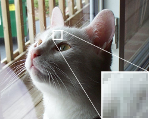
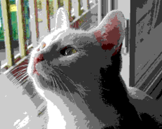
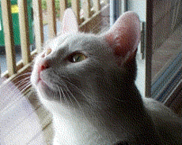

## 详解

<Callout type="warn" title="适用情况">
  对于体积较小的画，使用抖动的效果反而可能会不如不抖动的效果，体积越大的画使用抖动的效果就会越好
</Callout>

颜色抖动，也称仿色，是尝试用较低的颜色位深度来获得更为丰富的视觉效果。比如下面这个例子

<figure className="flex flex-row items-center justify-center gap-4 [&_img]:my-auto [&_img]:h-50 [&_img]:w-auto [&_img]:object-contain [&_p]:my-0">
  <div>
    
    <figcaption className="text-center text-sm text-fd-muted-foreground">
      原始图像
    </figcaption>
  </div>
  <div>
    
    <figcaption className="text-center text-sm text-fd-muted-foreground">
      无抖动
    </figcaption>
  </div>
  <div>
    
    <figcaption className="text-center text-sm text-fd-muted-foreground">
      使用 Floyd-Steinberg
    </figcaption>
  </div>
</figure>

这个例子来自 [Wikipedia: Floyd-Steinberg Dithering](https://en.wikipedia.org/wiki/Floyd%E2%80%93Steinberg_dithering)。

对颜色抖动的效果和原理做描述的文章已经足够多，这里就不展开讲了。

## 可用的抖动算法

### Atkinson

由 **Bill Atkinson** 于 1982 年开发，最早用于 MacPaint。它把量化误差扩散到周围 6 个像素，但**只分配了 3/4 的误差**（剩余 1/4 被丢弃）：

```text
  X 1 1
1 1 1      ÷ 8
  1
```

**适用情况**

- 需要保留细节、画面更锐利更有冲击力时；注意结果会整体**偏暗**，暗部细节可能丢失。

### Burkes

由 **Theresa Burkes** 于 1988 年提出，是对 Sierra 算法的改进——把误差扩散到右侧 2 列共 7 个像素：

```text
    X 8 4
2 4 8 4 2    ÷ 32
```

**适用情况**

- 想比 Floyd-Steinberg 减少渐变条纹、又不想明显变慢的折中选择。

### Floyd-Steinberg

由 **Robert Floyd** 和 **Louis Steinberg** 于 1976 年提出，是误差扩散抖动的事实标准。它把量化误差按固定比例扩散到右方与下一行的 4 个像素：

```text
  X 7
3 5 1        ÷ 16
```

**适用情况**

- 绝大多数场景的默认选择：质量/计算量比最高、实现简单；但平滑渐变处容易出现**方向性条纹**。

### Stucki

由 **Peter Stucki** 于 1981 年提出，基于 Jarvis-Judice-Ninke 算法简化而来，把误差扩散到 3 行共 12 个像素：

```text
    X 8 4
2 4 8 4 2    ÷ 42
1 2 4 2 1
```

**适用情况**

- 对条纹伪影敏感、需要细腻渐变的大图；比 JJN 快且质量损失很小。

### Jarvis, Judice, and Ninke

由 **J. F. Jarvis**、**C. N. Judice** 和 **W. H. Ninke** 于 1976 年提出（常缩写为 JJN），把误差扩散到 3 行共 12 个像素，是最早的多行误差扩散算法之一：

```text
        X 7 5
3 5 7 5 3    ÷ 48
1 3 5 3 1
```

**适用情况**

- 扩散范围最大、纹理最均匀细腻，适合大尺寸图的平滑渐变；但计算开销也最大。

- 计算开销最大，每个像素需要累加 12 个邻居。
- 过度扩散可能使画面显得"灰"或"软"，高对比细节的保持能力较弱。

### Sierra3

由 **Frankie Sierra** 于 1989 年提出（Sierra 系列之一），采用 3 行共 10 个像素的扩散核，是质量与速度之间的良好折中：

```text
    X 5 3
2 4 5 4 2    ÷ 32
  2 3 2
```

**适用情况**

- 想要多行扩散的细腻效果、又不想付出 JJN 开销的场合，质量/速度折中最佳。
