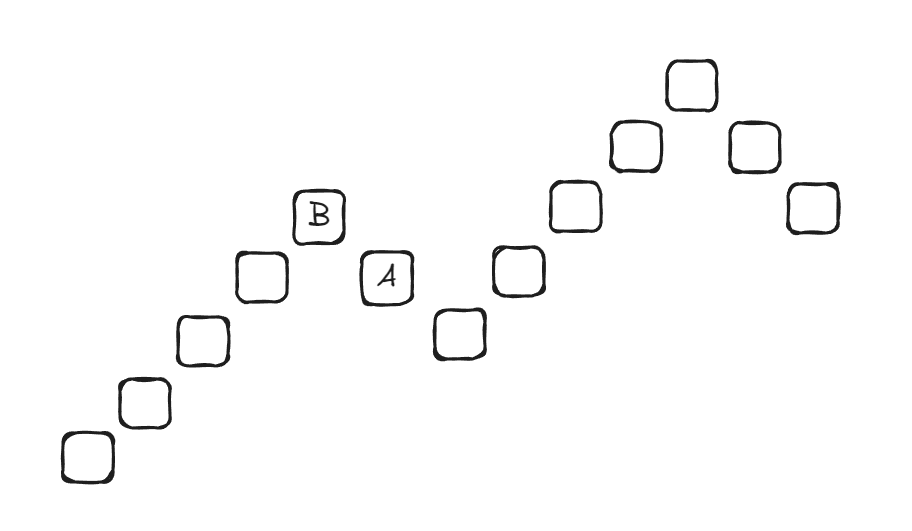
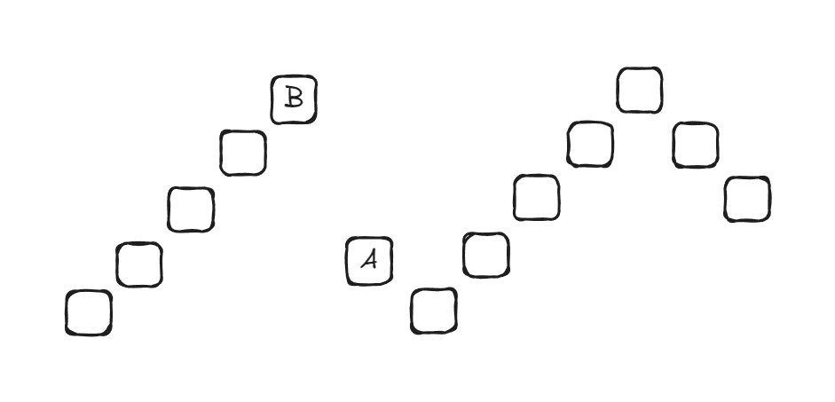

## 什么是阶梯式

简单来说，阶梯式像素画是一种立体的像素画，画的正面朝向竖直方向的正方向也就是 $y+$ 方向。在经过[压缩](#_8)之前，画的每一列（相同 $x$ 下 $z$ 轴的一列方块）会连续地高低起伏。

## 阶梯式有什么用

当你想要将像素画放进地图而不是简单地通过肉眼观察的时候，就需要用到阶梯式。阶梯式相比平铺地图画在地图中可以显示更多的颜色。

## 阶梯式的原理

阶梯式专为地图画而设计，是因为地图的特殊性质。

- 地图的尺寸与分辨率

地图的尺寸均为 $128\times 128$，默认缩放等级（Zoom Level）是 $0$。可以显示的区域大小是

$$
AreaSize=128\times 2^ZoomLevel\times128\times 2^ZoomLevel
$$

其中每个像素点可以代表的方块数量是

$$
1\space Map Pixel Represents=2^ZoomLevel
$$

但显示的区域大小和分辨率并无关系，分辨率一直都是 $128\times 128$，所以提高缩放等级并不能让画面更精细。

**唯一一种能提高画面效果的办法是用多张地图拼起来**

- 地图如何显示方块

> 由于之前论证了地图缩放等级无法影响画面效果，所以下面的公式均在缩放等级 $Zoom Level=0$ 的情况下讨论。当 $Zoom Level$ 不为 $0$ 时计算方法会有所变化

与直接用肉眼观察不同，一个方块在地图上的颜色与其纹理无关。

一个方块在地图上的颜色由两个值决定：**基色** 与 **阴影**。

基色是一个静态的数值，每个方块有其对应的基色，对于 Java 版，方块基色表可以查看 [Wiki](https://minecraft.wiki/w/Map_item_format)。对于基岩版，可以查看[这里](../../ref/mapcolors.md)。

一个方块的阴影值由其北侧方块的相对位置决定，假设一个方块的高度坐标为 $y_{South}$，其北侧方块的高度坐标为 $y_{North}$。则其 **阴影ID** 为

$$
ShadowID=\left\{\begin{aligned}
    0,\space y_{South}<y_{North}\\
    1,\space y_{South}=y_{North}\\
    2,\space y_{South}>y_{North}
\end{aligned}\right.
$$

> 水的阴影较为特殊，但我已经将水从调色板中移除，所以这里不做讨论

实际上阴影ID还可以为 $3$，但无法通过正常途径获得，在 [_joodicator/mcmapimg_](https://github.com/joodicator/mcmapimg/blob/master/mcmapimg/mcmapimg.py) 项目中有以下代码：

```python title="mcmapimg/mcmapimg.py" lineNumbers=89
shade_mul = \
    180 if shade_id == 0 else \
    220 if shade_id == 1 else \
    255 if shade_id == 2 else \
    220 if shade_id == 3 and version == '1.8.0-' else \
    135 if shade_id == 3 and version == '1.8.1+' else None
```

通过阴影ID可以得到对应的 **阴影值** ：

$$
Shadow=\left\{\begin{aligned}
    180,\space ShadowID=0\\
    220,\space ShadowID=1\\
    255,\space ShadowID=2
\end{aligned}\right.
$$

最后通过基色与阴影值得到 **地图色** ：

$$
MapColor=BaseColor * Shadow \div 255
$$

代码形式：

```rust title="src/generator.rs" lineNumbers=314
fn shade_rgb(c: &[u8; 3], shade: i32) -> [f32; 3] {
    [
        (c[0] as i32 * shade / 255) as f32,
        (c[1] as i32 * shade / 255) as f32,
        (c[2] as i32 * shade / 255) as f32,
    ]
}
```

所以可以很轻松地意识到，如果只是平铺的地图画，一种方块只能显示一种颜色，但如果使用阶梯式，一种方块就能三种可能的颜色，大大地拓展了可选的颜色数量，提升了画面效果。

## 基岩版的特性

前面提到，当北侧方块比当前方块的相对位置较高或较低时，会改变当前方块的地图色。
但与 Java 版不同的是，在 Java 版中，北侧方块可以只高或者低出一格，与其相差很多格的效果都是相同的，
但在基岩版中，如果两个方块只相差一格，则会产生 **马赛克样式的图案**，把相差高度改到两格或以上就可以消除马赛克，所以 Colorify 的默认阶梯式间隔高度是 $2$ 而不是 $1$，
但相应的会占据更多的空间，您可以在高级参数中的阶梯式竖向间隔一参数修改此项数值。

## 阶梯式的压缩

由于阶梯式是立体的，相比平面式像素画会占用更多的竖向空间，然而竖向空间是有限的，所以我加入了一种无损的压缩办法来尽可能地使其占用的竖向空间变小
并加入了整体偏移，使得所有方块都会生成在基准点的上方，以便生成时控制阶梯式像素画的大概位置。

<Callout type="info" title="有损压缩">
  暂时不会考虑加入有损压缩法
</Callout>

压缩的具体实现

### 压缩的可能性

记阶梯式高度间隔参数（你的输入）为 `N`，在启用压缩下实际生效间隔 `Step` 为

$$
Step=\left\{\begin{aligned}
    2,\space N>=2\\
    N,\space Otherwise
\end{aligned}\right.
$$

阶梯式的阴影值实际上反映了两侧方块对当前方块的高度的不等式约束。
压缩的可能性就存在于，比如我们要求方块 A 需要比方块 B 高出 Step 格，但是实际上方块 A 的高度可以比方块 B 高出 $[Step, \infty)$ 之间的任意整数格，也就是

$$
H_A-H_B\geq Step
$$

相应地，当我们要求方块 A 需要比方块 B 低出 Step 格时，实际上方块 A 的高度可以比方块 B 低出 $(-\infty, -Step]$ 之间的任意整数格。

比如假如我们有这样一条阶梯式序列



可以看到，目前我们初始要求 A 比 B 要低 1 格，现在初始高度为 H=7。

那么就有一种更优的方案如下



经过优化，目前 A 比 B 低 3 格，所有阴影关系仍然一致，但总高变为了 H=5，节省了 2 格的竖向空间。

需要说明的是，压缩后的阶梯式排列有很多种可能性，但他们都指向了唯一的一个最小 H。

且得益于阶梯式的每列都是独立的，所以并行地对每一列进行压缩即可。

### 压缩的算法原理

前面提到，一个方块的高度同时取决于其两侧方块对其的约束，那么我们把一列连续实心方块编号为节点 $0,1,2,...,n-1$（从北到南），就有约束关系

$$
y_{k+1}-y_k\in[L_k, U_k]
$$

其中：
- Shade 0: $L_k=+Step$， $U_k=+\infty$
- Shade 1: $L_k=0$， $U_k=0$
- Shade 2: $L_k=-\infty$， $U_k=-Step$

另：
- 我们外加基准线规则，让所有阶梯式方块的高度都大于等于 0（以便生成在玩家上方避免插进地里），也就是：$y_k \geq 0$。

压缩的处理逻辑就是通过正反两次约束传递来求出每个方块的最低可能高度。

我们维护一个数组 `low`，其中 `low[k]` 表示第 k 个方块的最低可能高度。

#### 正向传播

- 第一趟传播，从北到南，只考虑北侧对南侧的要求

$$
low[0]=0
$$
$$
low[k+1]=\max(low[k]+L_k, 0)
$$

其中：
- Shade 0: $L_k=+Step$，南侧必须更高，至少高一个 Step，所以 $low[k+1]=low[k]+Step$
- Shade 1: $L_k=0$，两侧等高，$low[k+1]=low[k]$
- Shade 2: $L_k=-\infty$，南侧只要求更低，所以南侧可以贴到下限 $0$

#### 反向传播

- 第二趟传播，从南到北，在前面的基础上加上南侧对北侧的要求

$$
low[k]=\max(low[k], low[k+1]-U_k)
$$

其中：
- Shade 0: $U_k=+\infty$，不产生北侧下限，跳过
- Shade 1: $U_k=0$，两侧等高，$low[k]=low[k+1]$
- Shade 2: $U_k=-Step$，北侧必须更高，至少高一个 Step，所以 $low[k]=low[k+1]+Step$

#### 为什么？

前面提到，因为一个方块的位置只取决于其两侧的约束，那么只要算出两侧的约束，然后取最大值即可同时满足两侧的约束，此时的值即为该方块的最低理论可能高度，任意合法解都必须大于等于这个值。

代码形式

```rust title="src/generator.rs" lineNumbers=631
fn compress_staircase_column(col: &mut [StairCell], step: i32) {
    let height = col.len();
    let mut i = 0;
    while i < height {
        while i < height && col[i].y == i32::MIN {
            i += 1;
        }
        if i >= height {
            break;
        }
        let start = i;
        let mut end = i;
        while end < height && col[end].y != i32::MIN {
            end += 1;
        }
        let n = end - start;

        let mut low = vec![0i32; n];
        for k in 0..n - 1 {
            let l = match col[start + k + 1].shade {
                0 => step,
                1 => 0,
                _ => i32::MIN,
            };
            low[k + 1] = if l == i32::MIN {
                0
            } else {
                (low[k] + l).max(0)
            };
        }
        for k in (0..n - 1).rev() {
            let u = match col[start + k + 1].shade {
                0 => i32::MAX,
                1 => 0,
                _ => -step,
            };
            if u != i32::MAX {
                let v = low[k + 1] - u;
                if v > low[k] {
                    low[k] = v;
                }
            }
        }
        for k in 0..n {
            col[start + k].y = low[k];
        }
        i = end;
    }
}
```

SlopeCraft 使用的算法与 Colorify 不同，但其也达到了压缩 H 到理论最小值的目的

[https://github.com/SlopeCraft/SlopeCraft/blob/main/SlopeCraftL/optimize_chain.cpp](https://github.com/SlopeCraft/SlopeCraft/blob/main/SlopeCraftL/optimize_chain.cpp)

## 搭桥

由于基岩版还没有真正意义上的投影Mod，所以暂时不会加入搭桥功能。

## 参考

如果您感兴趣，您也可以参考以下链接：

- SlopeCraft 文档: 原理简介

[https://slopecraft.readthedocs.io/principles-introduction/](https://slopecraft.readthedocs.io/principles-introduction/)

- Minecraft Wiki：Map Item Format

[https://minecraft.wiki/w/Map_item_format](https://minecraft.wiki/w/Map_item_format)

- MCModify: Map.java

[https://github.com/LB--/MCModify/blob/java/src/main/java/com/lb_stuff/mcmodify/minecraft/Map.java](https://github.com/LB--/MCModify/blob/java/src/main/java/com/lb_stuff/mcmodify/minecraft/Map.java)

- minecraftmap: \_\_init\_\_.py

[https://github.com/spookymushroom/minecraftmap/blob/master/minecraftmap/\_\_init\_\_.py](https://github.com/spookymushroom/minecraftmap/blob/master/minecraftmap/__init__.py)

- mcmapimg: mcmapimg.py

[https://github.com/joodicator/mcmapimg/blob/master/mcmapimg/mcmapimg.py](https://github.com/joodicator/mcmapimg/blob/master/mcmapimg/mcmapimg.py)
