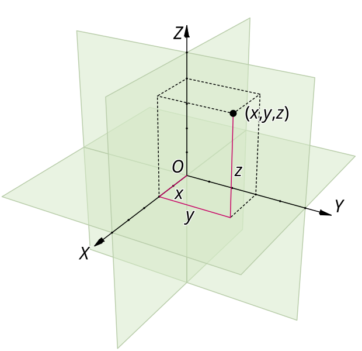

## 这个参数有什么用？

这个参数允许您在生成像素画时指定目标所在的平面。通过选择不同的平面，您可以控制生成的像素画在三维空间中的位置和方向。

允许的值有：xOy、xOz、yOz。

> 其实每个面应该还有三个旋转的，但目前我有点懒得实现

如果您不知道这三个平面分别对应什么方向，可以参考下图：

<Callout type="warn" title="高度轴">
  与 Minecraft 中的坐标系不同，Colorify 的坐标系中 Y 轴是高度轴，X 轴和 Z 轴是水平轴。
</Callout>

<figure className="flex flex-col items-center [&_img]:w-2/3 [&_img]:mx-auto [&_p]:my-0">

  <figcaption className="text-center text-sm text-fd-muted-foreground">
    三维笛卡尔坐标系示意图 | 图片来源：[Wikipedia](https://en.wikipedia.org/wiki/Cartesian_coordinate_system#/media/File:Coord_system_CA_0.svg)
  </figcaption>
</figure>