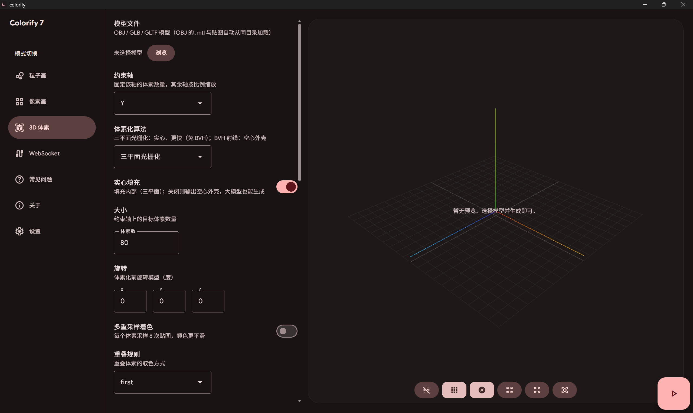
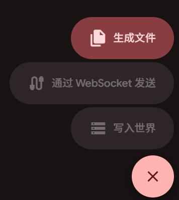
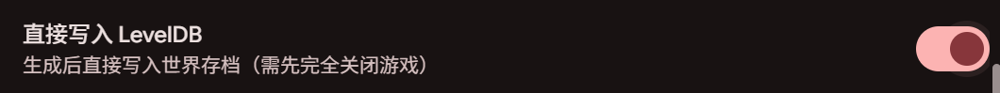
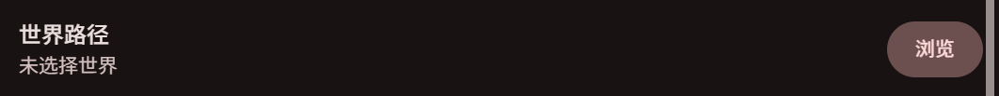
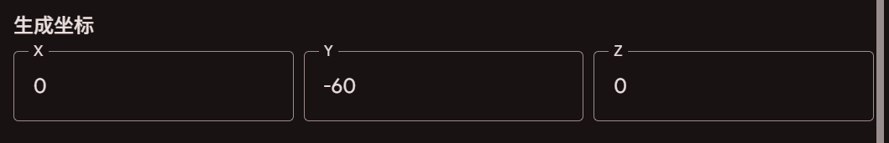

## 什么是3D体素

简单地来说，3D体素就是在三维空间中使用 Minecraft 方块来模拟一个三维模型的效果。与像素画不同的是，3D体素不仅仅是二维的平面，而是具有高度、宽度和深度的立体结构。

您也可以参考以下几个来源的解释

  <Card
    title="百度百科 - 体素"
    description="三维空间分割上的最小单位"
    href="https://baike.baidu.com/item/%E4%BD%93%E7%B4%A0/8945761"
  ></Card>
  <Card
    title="Voxel - Wikipedia"
    description="In computing, a voxel is a representation of a value on a three-dimensional regular grid, akin to the two-dimensional pixel."
    href="https://en.wikipedia.org/wiki/Voxel"
  ></Card>

## 来到体素生成页面

点击体素生成页面按钮（方块模样图标，导航栏第三个）时，您便会处在体素参数页面。

## 设置参数

在上图中可以很直观地看到，体素生成页面被分为两大区域，左侧是**参数设置区域**，右侧是**预览区域**

如果您对怎样设置各种参数没有头绪，请在左侧文档目录查看 **参数表**

<Callout type="tip" title="提示">
  如果您实在是拿不准怎么填写各个参数，我的建议是：什么也不要填
</Callout>

## 预览区

<Callout type="warning" title="安卓不支持预览">
  出于性能考虑，安卓版本的 Colorify
  不支持预览功能，所以在安卓设备上您将无法看到预览效果
</Callout>

在预览区，您可以实时查看体素建筑的生成效果。

在导入了模型以后，你可以预览白模。在生成完毕以后，你可以预览体素建筑的效果。

<Callout type="info" title="降采样">
  当模型超过 15 万三角形，预览时 Colorify
  会自动对模型进行降采样，以保证预览的流畅性。所以对于部分高模，预览效果可能会比较破碎，但不会影响最终生成的体素建筑效果。
</Callout>

## 生成体素建筑

当你选择了一个模型并完成了参数表的设置后，就可以开始生成体素建筑了。

在 3D 体素页面右下角有一个三角图案按钮，点击就会展开三种生成方式的选择按钮

<figure className="flex flex-col items-center [&_img]:mx-auto [&_p]:my-0">
  
</figure>

### 方法一：生成文件

#### 生成 .mcfunction 文件

默认情况下，Colorify 将生成一堆 .mcfunction 文件。

<Callout type="warning" title="不推荐使用 .mcfunction 文件">
  体素建筑通常体积较大，这会导致

  1. 生成的 .mcfunction 文件数量过多，通常 > 10 个
  2. 尺寸过大时执行 function 会有部分离玩家较远的区域无法被加载，导致体素建筑生成不完整。所以推荐您使用**直接写入 LevelDB**方法来生成体素建筑
</Callout>

<Callout type="warning" title="什么是 .mcfunction 文件？">
  即函数文件，是 Minecraft
  基岩版中一种可以执行一系列命令的文件。如果您不知道如何使用这类文件，我推荐您看[这个视频](https://www.bilibili.com/video/BV12t411R7Ct/)
</Callout>

#### 生成 .mcstructure 文件

<Callout type="warning" title="不推荐使用 .mcstructure 文件">
体素建筑通常体积较大，这会导致

1. 生成的 .mcstructure 文件体积过大，通常 > 100 MB

2. 尺寸过大的 .mcstructure 文件无法被游戏正常加载。所以推荐您使用**直接写入 LevelDB**方法来生成体素建筑
</Callout>

<Callout type="warning" title="什么是 .mcstructure 文件？">
  即结构文件，是 Minecraft 基岩版中一种可以执行一系列命令的文件。如果您不知道如何使用这类文件，我推荐您先看上面的如何使用 .mcfunction 文件的教程，然后对应地把 .mcstructure 文件放到 structures 文件夹下，并在游戏中使用 `/structure` 命令或是结构方块来加载它。

当然，您也可以查看 [Minecraft Wiki - Structure Block](https://minecraft.wiki/w/Structure_Block) / [Bedrock Wiki - .mcstructure](https://wiki.bedrock.dev/nbt/mcstructure)

</Callout>

当您启用了[使用结构]()时，Colorify 将生成一个 .mcstructure 文件。

### 方法二：通过 WebSocket 传输

<Callout type="warning" title="不推荐使用 WebSocket 传输">
  体素建筑通常体积较大，这会导致

  1. WebSocket 传输执行命令的速度较慢，通常需要几分钟甚至几十分钟才能完成体素建筑的生成
  2. 尺寸过大时执行 function 会有部分离玩家较远的区域无法被加载，导致体素建筑生成不完整。所以推荐您使用**直接写入 LevelDB**方法来生成体素建筑
</Callout>

上图可以注意到，“通过 WebSocket 发送”按钮是灰的，这表示 WebSocket 服务器还未启动或是没有任何实例连接。在正确启动 WebSocket 服务器并在游戏内连接后，Colorify 便可以通过 WebSocket 发送体素建筑数据到游戏中。

<Callout type="warning" title="关于 WebSocket 传输">
  WebSocket 传输执行命令的速度较慢，且在最近的版本中，WebSocket
  不再能强制加载较远的区域，所以更推荐使用直接写入 LevelDB 来生成体素建筑
</Callout>

### 方法三：写入世界 - 直接写入 LevelDB

<Callout type="warning" title="检查您的 Colorify 版本">
  该方式从 **Colorify v.7.0.1** 开始支持，若您使用的 Colorify 版本低于
  v.7.0.1，请升级到最新版本
</Callout>

这是最推荐的方式来生成体素建筑。相比于前两种方式，**直接写入 LevelDB**的方式有着**更更更更更更更快的速度和更更更更更更更高的效率**，且易于操作，不需要担心区块加载的问题，可以节省您宝贵的时间与精力。生成开始后您可以去泡一杯咖啡，回来时您的建筑大概已经生成完毕。

通过这种方式，您可以直接将体素建筑数据写入到 Minecraft 的世界中，而**不需要打开游戏**或是通过命令或结构文件来实现。在测试下，**即便是对于有着 200 格高度，上百万个方块的体素建筑，也能在短时间内（通常为 2 分钟以内）完成生成。**

上图可以注意到，“写入世界”按钮是灰的，这表示您还没有打开“直接写入 LevelDB”按钮或是没有指定有效的世界目录。

请按照以下步骤来使用直接写入 LevelDB 来生成体素建筑

<Steps>

<Step>
  如果您不确定您的操作是否正确，请先备份您的世界，以免意外发生，损毁您的存档或是部分建筑。如果出现了任何问题，我们不对您造成的损失负责
</Step>

<Step>
  记住您要生成体素的起始位置（模型中心），即像素画将从这个位置开始生成，向四面八方扩展
</Step>

<Step>
打开 “直接写入 LevelDB” 按钮

</Step>

<Step>
  此步骤为安卓用户专属。

将您的世界目录复制到 storage/emulated/0/Download/colorify/ 下，Colorify 将会自动识别您的世界目录

  <Callout type="warning" title="只能是 Download/colorify 下">
    虽然其余外部存储目录理论上也可以被读取，但是我们约定 Colorify 只读取 Download/colorify 下的世界目录，所以请务必将您的世界目录放在 Download/colorify 下
</Callout>
</Step>

<Step>
  在 “世界路径” 参数（“直接写入 LevelDB”参数的下一个参数）一栏点击 “浏览” 按钮，选择您的世界

</Step>

<Step>
  在 “生成坐标” 参数（“世界路径”参数的下一个参数）一栏填入刚刚记住的起始位置坐标

</Step>

<Step>
    点击 “写入世界” 按钮，Colorify 将会直接将体素建筑数据写入到您选择的世界中

    如果您的画体积较大，Colorify 可能需要一些时间来完成写入，请耐心等待

</Step>

<Step>
    此步骤为安卓用户专属。

    写入完成后，在 storage/emulated/0/Download/colorify/ 下的对应世界就已经被修改，您可以将其打包为 .mcworld 文件，然后使用 Minecraft 打开它。如果您有操作权限，也可以直接将其移动到 Minecraft 的 worlds 文件夹下，然后在游戏中打开它

</Step>

<Step>
  打开 Minecraft，进入您刚刚写入的世界，您就可以看到您的体素建筑已经生成了
</Step>

</Steps>
