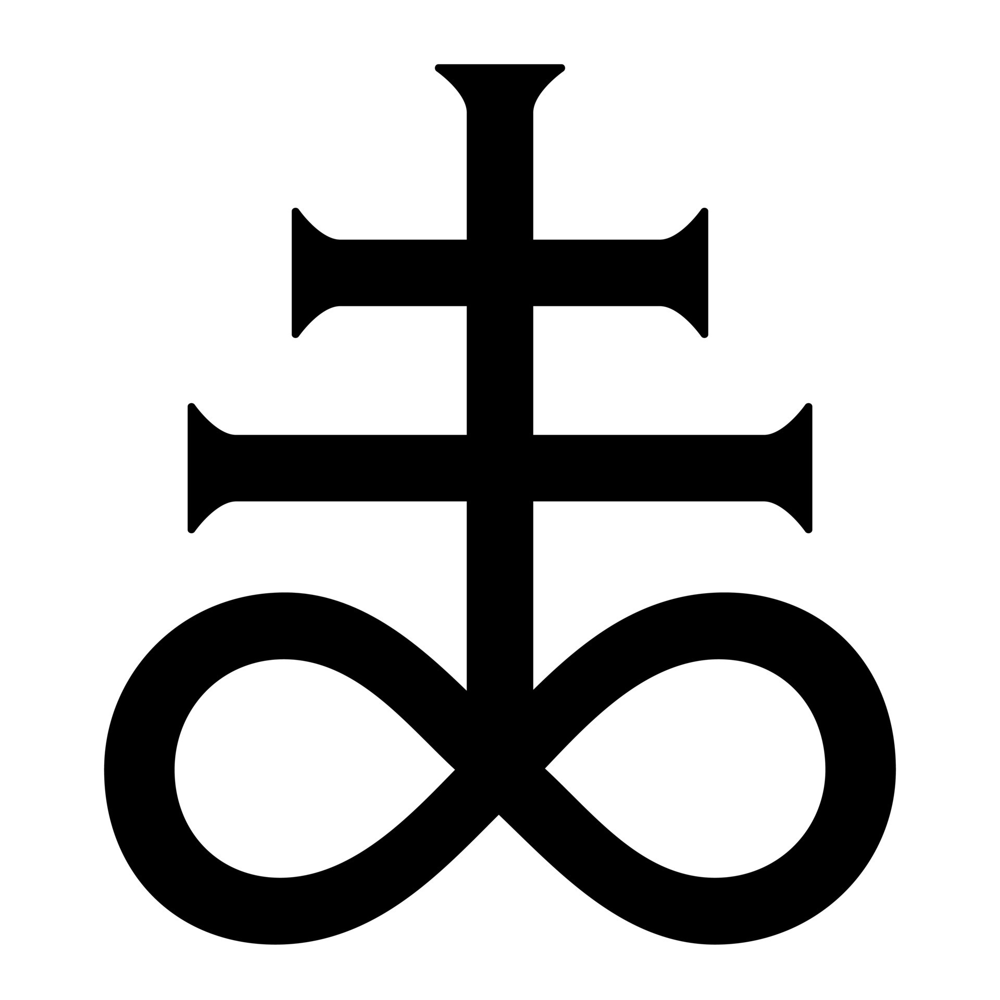

import { GameInfoBox } from "@/components/gameInfoBox";
import icon from "../../assets/wiki/tower_icons/magic_tower_icon_4_2.png";
import sacrifice_to_moloch from "../../assets/wiki/tower_skills/sacrifice_to_moloch.png";
import furnace_of_iquity from "../../assets/wiki/tower_skills/furnace_of_iniquity.png";

> 如果你一只手使你犯罪，就砍掉它！拖着残废的身体进入永生，胜过双手健全却落入地狱不灭的火中。倘若你一只脚使你犯罪，就砍掉它！瘸着腿进入永生， 46 胜过双脚健全却被丢进地狱！如果你的一只眼睛使你犯罪，就剜掉它！独眼进上帝的国，胜过双目健全却被丢进地狱。在那里，“虫是不死的，火是不灭的。” -- 《马可福音》9:43-48
>
> 当时，耶和华把硫磺与火，从天上耶和华那里降与所多玛和蛾摩拉，把那些城和全平原，城里所有的居民和土地上生长的，都毁灭了。罗得的妻子在他后边回头一看，就变成了一根盐柱。亚伯拉罕清早起来，到了他先前站在耶和华面前的地方，面向所多玛和蛾摩拉，以及平原全地观望。他观看，看哪，那地有浓烟上腾，好像烧窑的浓烟。-- 《创世记》19:24-28

地狱之塔（Gehenna）是一座四级法术塔，可由天灾术士升级而来。

<GameInfoBox
  title="地狱之塔"
  subtitle="Gehenna"
  type="tower"
  image={icon.src}
  attributes={[
    { label: "建造花费", value: "300" },
    { label: "血量", value: "150" },
    { label: "攻击力", value: "0 ~ 200" },
    { label: "攻击速度", value: "20 次每秒" },
    { label: "伤害类型", value: "魔法-火焰" },
  ]}
  lore="硫磺与火"
>

## 行为

在攻击范围内锁定单个敌人直至其死亡或是离开范围，使其附着硫磺火，不间断地燃烧，每 Tick 造成（魔法类-火焰）伤害，伤害随时间增加。

帧（刻）伤害计算公式如下

$$
\Large DPF=\min(e^{\alpha t},200)
$$

其中

- $t$ 为时间，单位 Ticks。
- $\alpha$ 为常数，值为 $0.016075$
- $200$ 即最大帧伤，在 $\alpha=0.016075$ 的情况下约需要 329.6 Ticks 达到此最值

$\alpha$ 的值由下式解得

$$
\Large \sum^{200}_{i=0}e^{i\alpha}=1500
$$

意思就是，在这样的情况下，地狱塔锁定单个敌人长达 **10s** 后对其造成的伤害约为 **1500**。

特别地，当地狱之塔攻击的目标是 BOSS 时，固定造成每秒 **50** 点（魔法类-火焰）伤害。

</GameInfoBox>

<GameInfoBox
  title="摩洛克的献祭"
  subtitle="Sacrifice to Moloch"
  image={sacrifice_to_moloch.src}
  attributes={[
    { label: "升级花费", value: "80" },
    { label: "可用等级", value: "0 / 1" },
    { label: "冷却时间", value: "40 秒" },
  ]}
>

## 主动技能 摩洛克的献祭 Sacrifice to Moloch

> 他们在欣嫩子谷建筑巴力的邱坛，好使自己的儿女经火归摩洛 -- 《耶利米书》32:35

手动释放。使正在攻击的非 BOSS 类敌人死亡，该即死效果无法被任何机制格挡或取消。如果作用的对象是 BOSS，那么效果变为：立即对其造成 200 点伤害，同时施加无限时长、不可叠加的硫磺火减益，每秒造成 20 点伤害。

此秒杀虽然优先级不如[暗影火枪](./archer4_dark_musket.mdx)的被动技能“融入黑暗”，但目前也没有机制可以阻挡，所以仍然是一个真正意义上的秒杀技能。

</GameInfoBox>

<GameInfoBox
  title="罪业焚炉"
  subtitle="Furnace of Iniquity"
  image={furnace_of_iquity.src}
  attributes={[
    { label: "升级花费", value: "80" },
    { label: "可用等级", value: "0 / 1" },
  ]}
>

## 被动技能 罪业焚炉 Furnace of Iniquity

持续生效。伤害提升的速度增加（$\alpha$ 的值提升至 $0.016923$，在此数值下，10s 造成的伤害约 1700）。如果主动技能已经解锁，每杀死一个敌人使得主动技能的冷却减少 **2s**。

</GameInfoBox>

## 轶事

- 该塔名字 “Gehenna” 来源于希伯来语中对过去位于耶路撒冷城墙外的谷地[“欣嫩谷”](https://baike.baidu.com/item/%E6%AC%A3%E5%AB%A9%E8%B0%B7/212329)（亦称欣嫩子谷）的称呼 “Ge Hinnom”。
其词源可追溯至后圣经希伯来语 “gehinnom”，意指“地狱，死者的火焰折磨之地”。
在《圣经》希腊文中为 “Gehenna”（γεέννα），中文音译为“矶汉拿”。
其意义现已从一个具体的地理名称演变为犹太教、基督教及伊斯兰教经典与神话中“地狱”、“永火之地”或“罪人受罚之处”的核心象征。
在《希腊语经卷》中，“矶汉拿”一词出现了12次，其中5次与火关联。

- 该塔图标来源于游戏《以撒的结合：重生》（The Binding of Isaac: Rebirth）中的道具[“硫磺火”](https://isaac.huijiwiki.com/wiki/C118)。

其图标来源于炼金术中的硫磺，也称“利维坦十字” （The Leviathan Cross）/ “撒旦十字” （The Satan's Cross）。
撒但教创始人 Anton LaVey 在撒但圣经中将该图标用作地狱的象征，现在这个图标常常让人联想到恶魔崇拜等信仰。

<figure className="grid grid-cols-2 gap-4 [&_div]:flex [&_div]:flex-col [&_div]:items-center [&_img]:my-auto [&_img]:h-50 [&_img]:w-auto [&_img]:max-w-full [&_img]:object-contain [&_img]:[image-rendering:pixelated] [&_p]:my-0">
  

    
    <figcaption className="text-center text-sm text-fd-muted-foreground">
      硫磺火 Brimstone
    </figcaption>
  

  

    
    <figcaption className="text-center text-sm text-fd-muted-foreground">
      The Leviathan Cross / The Satan's Cross
    </figcaption>
  

</figure>
