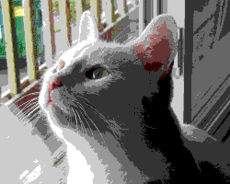
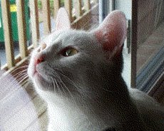

# 颜色抖动 Dithering

## 简介

启用该参数则会使用 Floyd-Steinberg 算法预处理一遍图像

## 参数细节

类型：`bool`

## 详解

!!! warning "注意"

    对于体积较小的画，使用抖动的效果反而可能会不如不抖动的效果，体积越大的画使用抖动的效果就会越好

颜色抖动，也称仿色，是尝试用较低的颜色位深度来获得更为丰富的视觉效果。比如下面这个例子

<figure markdown="span">
  { width="300" }
  <figcaption>原始图像</figcaption>
  { width="300" }
  <figcaption>无抖动</figcaption>
  { width="300" }
  <figcaption>使用 Floyd-Steinberg</figcaption>
</figure>

这个例子来自 [Wikipedia: Floyd-Steinberg Dithering](https://en.wikipedia.org/wiki/Floyd%E2%80%93Steinberg_dithering)。

对颜色抖动的效果和原理做描述的文章已经足够多，这里就不展开讲了。

Colorify 使用了最为经典的 Floyd-Steinberg 抖动算法，大致实现如下：

```typescript
function find_closest_palette_color(v: RGB): RGB => { ... }

image.enumerate((x: number, y: number, pixel: RGB) => {
    const found = find_closest_palette_color(pixel);
    const quant_error = new RGB(
        r: pixel.r - found.r,
        g: pixel.g - found.g,
        b: pixel.b - found.b
    );
    image.setPixel(x + 1, y    , image.getPixel(x + 1, y    ) + quant_error * 7 / 16);
    image.setPixel(x - 1, y + 1, image.getPixel(x - 1, y + 1) + quant_error * 3 / 16);
    image.setPixel(x    , y + 1, image.getPixel(x    , y + 1) + quant_error * 5 / 16);
    image.setPixel(x + 1, y + 1, image.getPixel(x + 1, y + 1) + quant_error * 1 / 16);
});
```