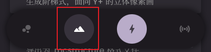
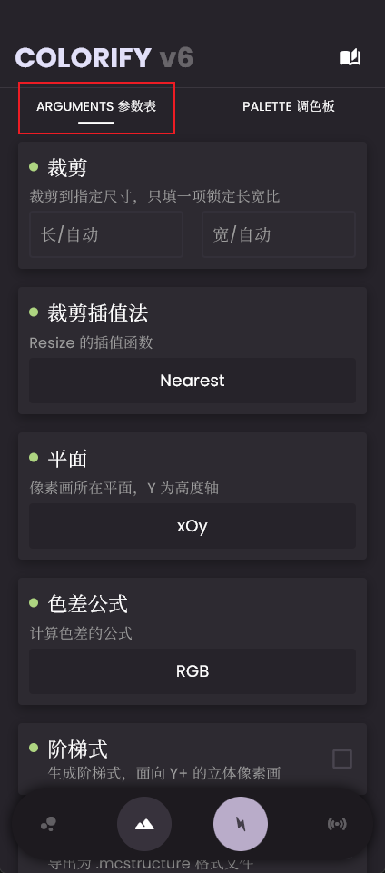
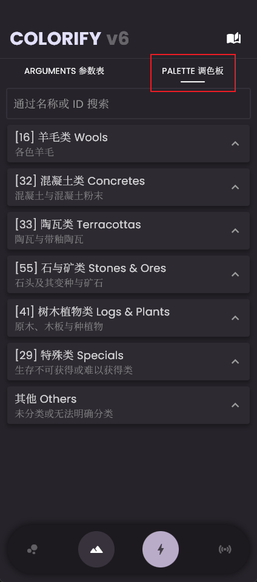
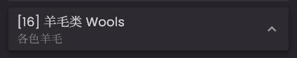
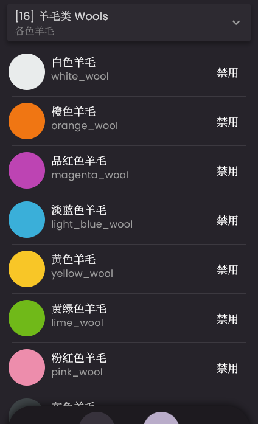
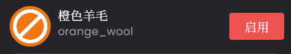
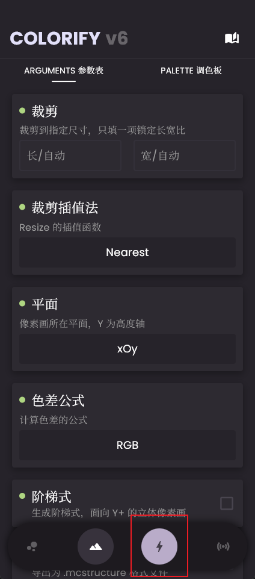
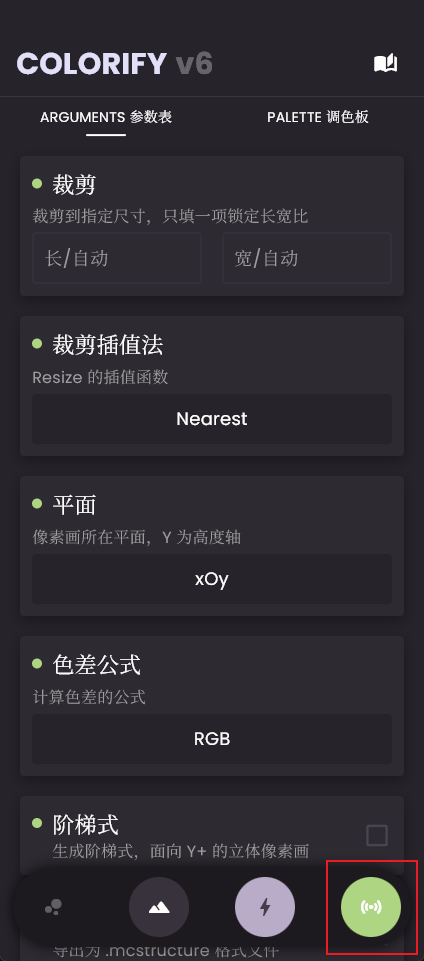

# 像素画（方块画）使用教程

像素画相信大家都很熟悉也很了解了，即用 Minecraft 原版方块去模拟图片的效果，那么直入主题。

## 来到像素画生成页面

点击像素画画页面按钮（山体模样图标，导航栏第二个）时，您便会处在像素画参数页面。

## 设置参数

来到像素画 -> 参数表页面，您可以在这里设置各种与像素画生成相关的参数。

如果您对怎样设置各种参数没有头绪，请打开左侧的目录查看 **参数表**

!!! tip "tip"

    如果您实在是拿不准怎么填写各个参数，我的建议是：什么也不要填

## 调色板

来到像素画 -> 调色板页面，您可以在这里调整调色板细节。

调色板拥有多个“类”，这是我对所有 Colorify 内置可用原版方块做的浅略分类，每一个类具有一个“表头”，如：

其中，“[16]”代表的是该类下有`16`个方块，数字后面即类名，是对当前大类特征的概括。

点击类表头任意地方即可展开类列表，查看当前类有的方块：

那么点击方块左侧的“禁用”后，该方块则不会出现在您的像素画中，且该方块条目会呈“禁用”状态，如：

点击“启用”，该方块则会恢复正常，有机会出现在您的像素画中。

## 生成像素画

当你完成了参数表与调色板的设置后，就可以开始生成像素画了。
大体上，您有 **两种方式** 可以生成像素画，分别是：

### 方法一：生成文件

像素画页面点击生成按钮（闪电模样图标，位于导航栏第三个）即会唤起图片选择，选中图片后便会开始生成像素画。

### 方法二：通过 WebSocket 传输

启动WebSocket连接后，在像素画页面点击WebSocket页面按钮，就可以 **按WS生成流程生成像素画**

