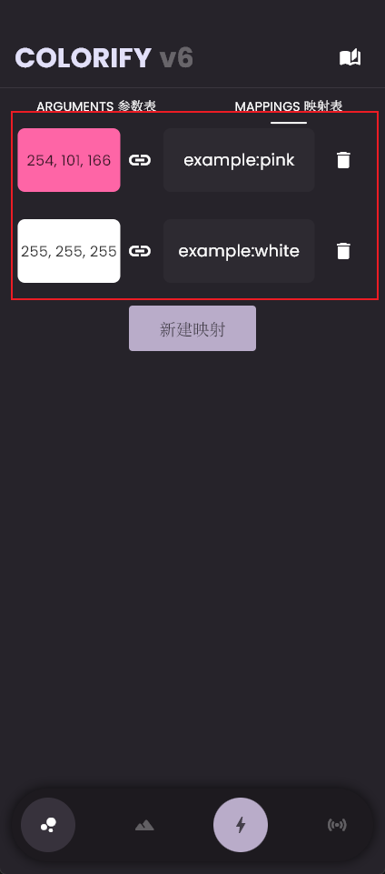

# 映射表

## 什么是映射表？

为了提高粒子画的可能性，并不止于描边画，Colorify 添加了映射表。

映射表顾名思义由一堆映射组成，是 **粒子名称** 到 **颜色** 的[映射](https://en.wikipedia.org/wiki/Map_(mathematics))。你可以简单地理解为粒子与颜色的对应关系

!!! tip "Tip"

    这里的颜色仅支持 RGB 形式（值区间为`0~255`）

## 怎么使用映射表？

比如：你创建了两个粒子，分别是`example:pink`，颜色为粉色，以及`example:white`，颜色为白色，然后你想要用这两个粒子来绘制B站的LOGO：


那么你就当然想要粉色的粒子去绘制图片中粉色的部分，白色的粒子绘制白色的部分也就是文字部分，你就可以建立以下两个映射：

```
example:pink -> pink

example:white -> white
```

通过任意方式取到图片中的颜色RGB值：

```
pink -> R: 254, G: 101, B: 166

white -> R: 255, G: 255, B: 255
```

那么映射即

```
example:pink -> R: 254, G: 101, B: 166

example:white -> R: 255, G: 255, B: 255
```

在 Colorify 中建立映射：



这样映射表就算是完成了，如果你有更多的颜色需求，那么创建新的粒子，然后再取色、新建映射即可。所有被添加在映射表里的映射都会在生成时启用（除了Dust 模式），顺序从上至下，上位优先匹配。