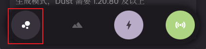
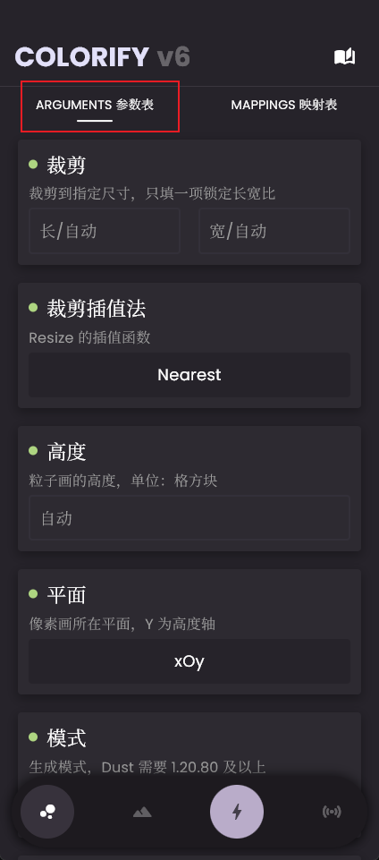

# 粒子画使用教程

粒子画，即用一堆粒子通过规律地排布去近似地呈现图片的图案。通常是一个粒子模拟一个像素。

将此页面从头到尾看一遍，相信您就会使用粒子画生成功能并在游戏中成功地生成粒子画。

## 粒子画能做到怎样的效果？

在 Minecraft 原版中内置了不少粒子（下称游戏内置粒子为 **原版粒子** ），但大多由于其形状、颜色、动画等原因不适宜用来绘制粒子画，Colorify 唯一的默认粒子即 `minecraft:endrod`（如果您使用的 Colorify 版本低于6.1.1，默认的粒子是`colorify:endrod`，从命名空间名称即可看出此粒子并非原版粒子，在打包生成时 Colorify 会自动生成这个粒子，这个粒子大概是`minecraft:endrod`的简化版），此粒子体积较小，动画简单，呈白色。

由于上面提到了默认的粒子`minecraft:endrod`呈白色且没办法动态地更改其颜色所以 **如果您不使用资源包添加自定义粒子，就没办法得到很好的粒子画效果**，在这样的条件下，粒子画通常为 *描边画*，即只描绘图片中的线条，比如魔法阵、二次元人物 **轮廓** 等等这样的图案可以得到比较好的效果，没办法描绘大面积的颜色（其实也行，只是所有颜色都只能是一种颜色：白色）。

当然，创建自定义粒子并不是什么麻烦事，在映射表中定义了映射并启用打包功能时 Colorify 都会 **自动地创建对应的纯色粒子供您使用**。

!!! warning "Warning"
    
    如果您在映射表中定义了非原版粒子并且 **没有启用打包功能** 时，即 Colorify 只会生成函数文件，如果您自己没有准备好对应的粒子，您在游戏里什么也看不见。

那么粒子画就只能做到这样吗？当然不是，粒子画甚至比像素画能做到的还要多，如果您的游戏版本在1.20.80及以上，不妨试试 **Dust 模式**。这个模式可以完美地、准确无误地重现您的图片的每一个像素的颜色。技术详情请见[这里](../arguments_table/particles/mode.md)。当您使用了Dust模式时，您只能[通过实体召唤粒子画](#_10)。

## 来到粒子画生成页面

点击粒子画页面按钮（三个泡泡模样图标，应用左下角，导航栏最左侧）时，您便会处在粒子画参数页面。



## 设置参数

来到粒子画 -> 参数表页面，您可以在这里设置各种与粒子画生成相关的参数。



如果您对怎样设置各种参数没有头绪，请打开左侧的目录查看 **参数表**

!!! tip "tip"

    如果您实在是拿不准怎么填写各个参数，我的建议是：什么也不要填

## 设置映射表

来到粒子画 -> 映射表页面，您可以在这里设置粒子 - 颜色映射。


映射表有什么用？怎么使用？请见[这里](./mappings.md)

## 生成粒子画

当你完成了参数表与映射表的设置后，就可以开始生成粒子画了。
大体上，您有 **两种方式** 可以生成粒子画，分别是：

### 方法一：生成文件

在粒子画页面点击生成按钮（闪电模样图标，位于导航栏第三个）即会唤起图片选择，选中图片后便会开始生成粒子画。


### 方法二：通过 WebSocket 传输

启动WebSocket连接后，在粒子画页面点击WebSocket页面按钮，就可以 **按WS生成流程生成粒子画**

!!! warning "Warning"

    需要提醒的是，Dust 模式依赖脚本引擎，所以不支持通过WebSocket传输

!!! warning "Warning"

    同时，因为 WebSocket 传输执行命令的速度 **非常有限**，加上粒子不像方块那样不变而是会消失的特性，通常你都不能够看到完整的粒子画，所以并不是很推荐使用 WebSocket 传输粒子画，除非您的图案简单，粒子数目少，粒子生命周期也较长


## 召唤粒子画

如果您使用的是 **通过 WebSocket 传输** 粒子画，下面的内容与您无关。您的教程到此为止。

如果您使用的是 **生成文件** 式粒子画，在您 **成功地将文件导入游戏后**，您有以下两种方式召唤粒子画：

### 方法一：通过命令(函数)召唤粒子画

此方法适用于所有情形，但可能需要您有 **一定的命令/函数相关知识**。

首先查看基于您的图片，Colorify 生成了多少个 function 文件（如果您没有启用打包，那么函数文件会生成在`colorify`下，相反则在`colorify/colorified/behaviour_pack/functions`下）。

函数文件以 `output_N.mcfunction` 的形式命名，`N`为序号，从`0`开始。

那么您需要做的就是按顺序将函数全部执行一遍即可。如果您不知道怎么执行函数，我推荐您看[这个视频](https://www.bilibili.com/video/BV1Tz4y1g7kb/)

### 方法二：通过实体召唤粒子画

此方法依赖脚本引擎，所以需要您 [**启用打包功能**](../common_issues.md/#_5)。

在您想要生成粒子画的地方使用这个命令：

```
/summon armor_stand particle:n ~ ~ ~
```

替换命令中的 `n` 为生成间隔，即你想要粒子画每隔多久生成一遍，单位为刻。

!!! tip "Tip"

    一秒 = 20 刻

这个命令会在您执行命令的位置生成一个名字为`particle:n`的盔甲架，此盔甲架则会成为粒子画生成的载体(并隐身)，在此实体死亡或是以任何形式被移除(反正就是没了)以后粒子便会停止生成。当然，你想的话可以再召唤一个。